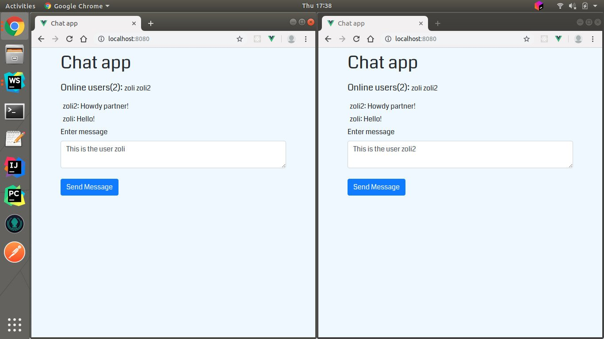

Pet project: Chat-app created with Node js (Express and Socket IO) and Vue js.

Once you have given yourself a name you can write your message in the textbox and send it.
Everyone can see your message if they also gave a name.
At the top you can see the online users, which automatically updates as soon as someone joins and leaves.
Under the online users, but above the textbox you can see the sent messages.

The picture shows two separate Chrome windows, as if two users were chatting with each other.

This repo only contains the backend part.
The front ends repo: https://github.com/zoltankonradi/chatappfrontend

